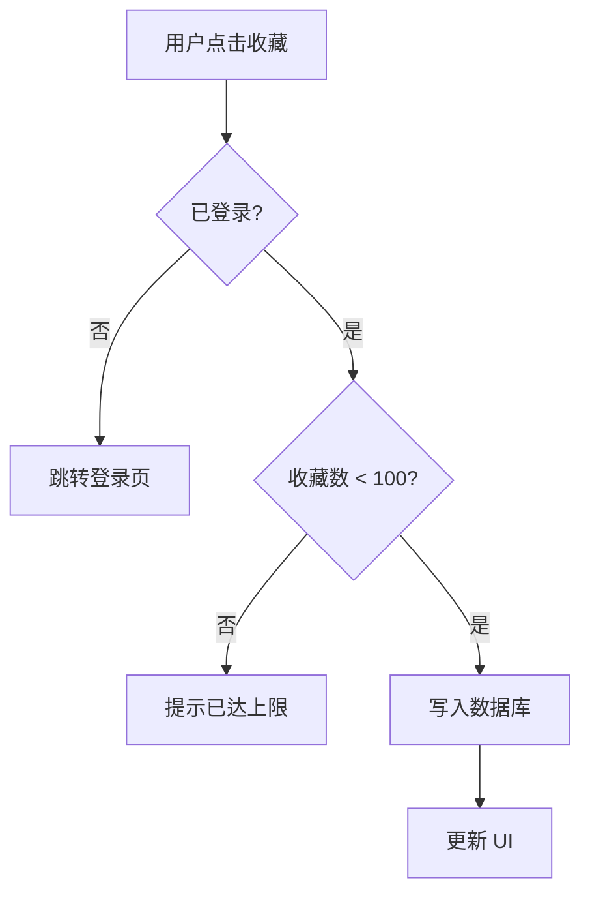
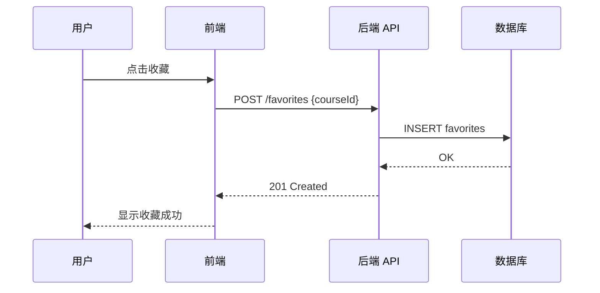
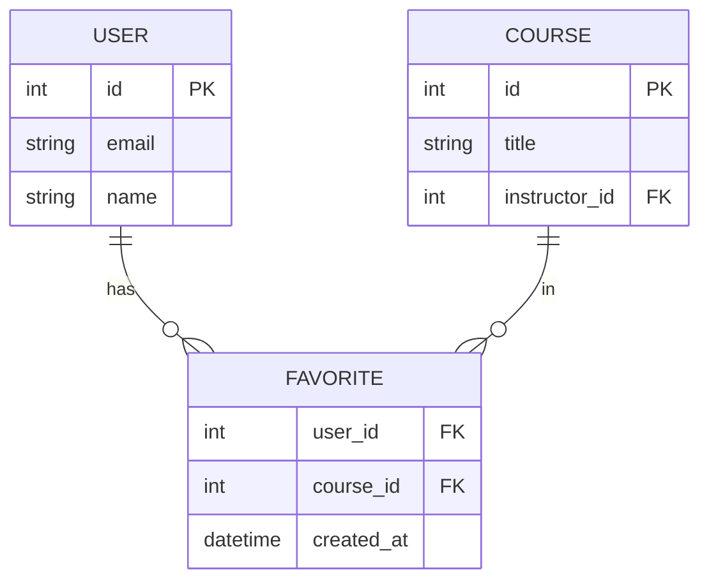
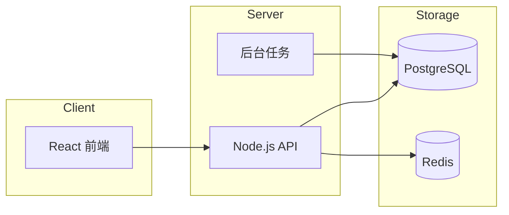

## 嵌入方式

在任何 GitHub Markdown 文件中（包括 Discussion、PR、Wiki、docs/）：

````markdown
```mermaid
{图的内容}
```
````

GitHub 原生渲染 Mermaid，无需额外工具。

---

## 常用图类型

### 流程图（Flowchart）— 描述业务流程、用户操作路径



### 时序图（Sequence）— 描述系统间的调用关系



### ER 图（Entity Relationship）— 描述数据模型



### 架构图（Flowchart 横向）— 描述系统组件关系



---

## 选择图类型的经验

| 我想表达什么 | 用什么图 |
|-------------|---------|
| 用户操作的步骤和分支 | flowchart |
| 服务/模块之间谁调用谁 | sequence |
| 数据库表结构和关联 | erDiagram |
| 系统整体组件架构 | flowchart LR |
| 状态机（订单状态流转） | stateDiagram-v2 |
| 版本/任务时间线 | gantt |

## 注意

- 图不要追求完整，只展示最关键的 3-5 个元素，细节用文字补充
- 节点名称用用户/业务语言，不用变量名
- 超过 10 个节点的图通常意味着需要拆分成多张图
